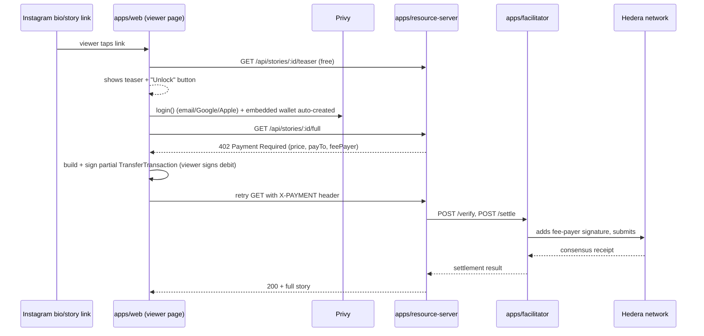

# x402 on Hedera: gated Instagram stories, unlocked from a fresh email

This covers the piece of the platform this session focused on: a viewer taps
"see the rest" on a gated story, and — with as little disconnection from the
original post as possible — ends up with a working Hedera account and a
completed micropayment.

## Why this shape

Three real, verified building blocks make the "minimal disconnection" goal
achievable today, and they compose almost for free:

1. **Hedera's own x402 "exact" scheme pays the network fee for the viewer.**
   Hedera's x402 integration ([hedera.com/blog/hedera-and-the-x402-payment-standard](https://hedera.com/blog/hedera-and-the-x402-payment-standard/))
   uses a *partially-signed transaction* model: the viewer signs a transfer
   authorizing the debit from their own account, but the transaction's
   declared fee-payer is the **facilitator's** operator account. The
   facilitator adds its own signature and submits. The viewer never needs
   HBAR for gas — full stop, no paymaster contract required. This is
   implemented for real in the `@x402/hedera` npm package (Coinbase's x402
   monorepo), which this repo uses directly (`apps/facilitator`,
   `apps/resource-server`).

2. **Hedera accounts auto-create from a Privy embedded wallet's address.**
   A Privy embedded wallet is a secp256k1 keypair with a standard EVM
   address (Hedera enabled ECDSA/secp256k1 keys via
   [HIP-222](https://hips.hedera.com/hip/hip-222)). Hedera lets you reference
   an account that doesn't exist yet by that same EVM address (an "alias" —
   [HIP-583](https://hips.hedera.com/HIP/hip-583.html)). The *first* transfer
   to that alias auto-creates a real ("hollow") account behind it. So: Privy
   login creates the wallet, and the very next HBAR transfer to it (the
   on-ramp top-up) is simultaneously the "create my Hedera account" step —
   there's no separate account-creation screen at all.

3. **HBAR needs no token association.** HTS tokens (including USDC on
   Hedera) require an explicit `TokenAssociateTransaction` on *both* sender
   and receiver before they can hold the token — an extra signed transaction,
   and one more thing that can fail (`TOKEN_NOT_ASSOCIATED_TO_ACCOUNT`) for a
   first-time viewer. Native HBAR has no such requirement. That's why
   `apps/resource-server` prices stories in tinybars, not Hedera-USDC — it's
   the difference between "one tap" and "two taps plus an association fee."

Given (1) and (2), **this repo does not use ZeroDev/ERC-4337 for the core
payment flow** — Hedera's native fee-payer/signer separation and hollow
account auto-creation already deliver "no pre-funded gas, no explicit account
creation," which is the problem account abstraction would otherwise be
solving. Nothing was found confirming ZeroDev has shipped Hedera support; if
you want it later, it'd slot in as an *optional* layer on Hedera's EVM JSON-RPC
relay (Hedera's Smart Contract Service is EVM-equivalent, so ERC-4337
infrastructure can in principle be deployed there) purely for session-keys —
letting a repeat viewer unlock a second and third story without a fresh Privy
signing prompt each time. Treat that as a v2 nice-to-have, not a dependency.

## Request flow



## What's implemented here

- `apps/facilitator` — the platform's own x402 facilitator for Hedera. Holds
  the operator key that pays every settlement's network fee. Exposes the
  three routes (`/verify`, `/settle`, `/supported`) that `@x402/core`'s
  `HTTPFacilitatorClient` expects.
- `apps/resource-server` — the paywall itself. One dynamic route,
  `GET /api/stories/:postId/full`, priced and paid-to per story (payTo is
  resolved from the authoring agent's ENS text record, `me.hedera.account`
  — the thin seam connecting this to the platform's ENS-identity piece).
  Also hosts `POST /api/hedera/sign`, the one endpoint that needs a real
  server to hold the Privy app secret (see "Why Vite" below).
- `apps/web` — a Vite + React Router SPA: the page an Instagram bio/story
  link points at. Teaser → Privy login → balance check → (funding prompt)
  → sign & pay → unlocked content, all on one screen. `PrivyProvider` is
  scoped to a lazily-loaded `UnlockFlow` component rather than mounted at
  the app root, so nothing wallet-related loads until the viewer actually
  taps Unlock.

### Why Vite, not Next.js

This was originally built on Next.js App Router. Two problems specific to
that combination — not to the x402/Hedera logic itself — motivated
switching:

1. **A crash, not just slow**: `@privy-io/react-auth` pulls in
   WalletConnect/Reown AppKit's external-wallet connector stack (unused
   here — this app only uses Privy's embedded wallet), which pulls in
   viem's experimental "tempo" chain and a worker-pool module that does a
   dynamic `require()`. That's inert in a browser bundle but crashes with a
   native worker-thread error when Next tries to server-render it in Node.
2. **Next's dev-mode compile time for this route was minutes, not
   milliseconds**: this dependency graph is genuinely large (~12,700
   modules touched — WalletConnect + Reown AppKit + viem's full chain
   list). Next's webpack-based dev server eagerly compiles the *entire*
   reachable module graph for a route on first request, including
   `React.lazy()`/`next/dynamic()` targets (verified: splitting Privy into
   a lazily-loaded component did not reduce this — same ~65s, ~12,750
   modules, either way). In a cloud dev environment, that first request
   commonly exceeded the port-forwarding proxy's timeout, surfacing as a
   confusing 502.

Neither is fixable by reconfiguring Next.js — both are inherent to
webpack's dev-mode strategy of bundling the whole reachable graph upfront.
Vite's dev server instead serves ES modules on demand over native browser
`import`, pre-bundling third-party dependencies once via esbuild (cached
after that). Measured on this exact codebase: the initial `/p/:postId` page
load went from **45–82 seconds** (Next, cold compile) to **~50ms** (Vite);
even the worst case — the very first request that ever touches Privy's
whole dependency graph, with Vite's own cache cleared — was **~1 second**,
not a minute-plus. Subsequent requests reuse the cached pre-bundle at
~50ms. This is also why `PrivyProvider` staying scoped to the lazily-loaded
`UnlockFlow` component (rather than moving back to the app root) actually
pays off here, unlike under Next: Vite's on-demand serving means that
bundle genuinely isn't fetched until the viewer taps Unlock.

This also incidentally kills a second bug for good: the CORS/"localhost
means your own machine, not the forwarded container" class of error from
earlier in this project's history no longer exists, because
`vite.config.ts`'s dev proxy forwards `/api/*` to the resource-server
server-side — the browser only ever talks to one same-origin server, in
both dev and any production deployment that reverse-proxies
resource-server under that same origin.

## Setup steps

### 1. Hedera testnet accounts

1. Go to the [Hedera Portal](https://portal.hedera.com/), sign up, and claim
   a funded testnet account — this gives you an account ID and an ECDSA
   private key. Create (at least) two: one for the **facilitator** operator,
   one to use as a **test creator payout account** (`payTo` for a demo
   story).
2. Put the facilitator's account ID + key into `apps/facilitator/.env`
   (`HEDERA_FACILITATOR_ACCOUNT_ID`, `HEDERA_FACILITATOR_PRIVATE_KEY`).
3. For a demo story priced in HTS-USDC instead of HBAR, mint testnet USDC
   from the [Circle faucet](https://faucet.circle.com/) (pick "Hedera
   Testnet") and associate it on both accounts with
   `TokenAssociateTransaction` (see the `@x402/hedera` README for the exact
   snippet) — but note the default in this repo is HBAR, precisely to skip
   this step for viewers.

### 2. ENS for the demo agent

Set a text record `me.hedera.account` on the agent's ENS name (or subdomain)
to the Hedera account ID you want story payments to land in. `apps/resource-server/src/ens.ts`
resolves this at request time (5 min cache). Point `ETH_RPC_URL` at any
Ethereum RPC provider (Alchemy, Infura, etc.) — it's a read-only lookup.

### 3. Privy

1. Create an app at [dashboard.privy.io](https://dashboard.privy.io).
2. Enable **Email**, **Google**, and **Apple** login methods.
3. Under Embedded Wallets, set wallet creation to happen for all users on
   login (this repo's `UnlockFlow.tsx` also sets `createOnLogin:
   "all-users"` client-side).
4. Copy the App ID into `apps/web/.env.local`'s `VITE_PRIVY_APP_ID`, and
   generate an **App Secret** (Settings → API Keys) for
   `apps/resource-server/.env`'s `PRIVY_APP_ID` / `PRIVY_APP_SECRET` — those
   are only ever used server-side, in `POST /api/hedera/sign`. Never put
   the app secret in `apps/web`; a static Vite build has nowhere to keep it.
5. Under **Wallet infrastructure → Authorization keys**, create a new key.
   Save the **private** half into `apps/resource-server/.env`'s
   `PRIVY_WALLET_AUTHORIZATION_PRIVATE_KEY` — every call to a wallet's
   `/rpc` endpoint (including the `secp256k1Sign` call `hedera-sign.ts`
   makes) requires a request signed with this key, or Privy silently
   returns no signature at all. Copy the key's **id** (public, not a
   secret) into `apps/web/.env.local`'s `VITE_PRIVY_SESSION_SIGNER_ID`.
6. This app's embedded wallets use Privy's **TEE execution** model rather
   than on-device execution, so granting `apps/resource-server` access to a
   viewer's wallet goes through `useSessionSigners`/`addSessionSigners`
   (`UnlockFlow.tsx`), not `useDelegatedActions`/`delegateWallet` — Privy's
   SDK throws a runtime error if you use the on-device hook against a
   TEE-execution app. `addSessionSigners` is called once per unlock
   attempt, keyed off the authorization key's id from step 5; it's a no-op
   if that wallet already granted access.

The raw-signing step (`apps/resource-server/src/hedera-sign.ts`) is implemented against
`privy.walletApi.ethereum.secp256k1Sign({ walletId, hash })` from
`@privy-io/server-auth@1.32.5`'s real type definitions (fetched and
inspected from npm, not guessed) — that method exists specifically to sign
an arbitrary digest, as opposed to `signMessage`/`signTypedData` which both
hash an Ethereum-prefixed message. On the Hedera side, the route uses
`Transaction.addSignature(publicKey, signatureBytes)` rather than
`Transaction.signWithSigner()` — the latter requires implementing the full
`@hiero-ledger/sdk` `Signer` interface (11 methods, only one of which is
relevant here); `addSignature` is the same lower-level primitive real Hedera
wallet integrations (HashPack, WalletConnect) use to inject an
externally-produced signature into an already-frozen transaction. Both the
digest format (`keccak256(bodyBytes)`, 64-byte compact `(r, s)`, per
HIP-179) and the `signableNodeBodyBytesList` API used to obtain those bytes
were confirmed against the installed `@hiero-ledger/sdk@2.85.0` and
`@hiero-ledger/cryptography@1.19.0` source.

One thing worth knowing about this design: `apps/web/src/lib/hedera-privy-signer.ts`
pins the transaction to a single node account id (`0.0.3`) before freezing.
That's what keeps `signableNodeBodyBytesList` down to exactly one entry, so
`addSignature`'s plain-`Uint8Array` form applies without ambiguity. A
production version that wants resilience against that one node being
briefly unavailable should round-robin a small pool of node ids instead.

### 4. Funding the viewer's account (the open gap)

No onramp aggregator was confirmed at research time to deliver funds
directly to a Hedera network address, and Circle's CCTP (which many ramps
use for delivery) lists Hedera on its 2026 roadmap but hadn't shipped it.
Two ways to close this, in order of preference — check first, build second:

- **Path A**: query your chosen provider's live currency/network list
  (Onramper, Transak, MoonPay, Coinbase Onramp) for a Hedera destination.
  HBAR is commonly *purchasable* on these platforms; that's not the same as
  *deliverable to a Hedera account*, so confirm the destination-network
  support specifically. If it exists, this is a genuine one-tap flow:
  Apple/Google Pay → HBAR lands on the viewer's alias address → auto-creates
  their hollow account in the same step.
- **Path B (works today, adds float risk)**: onramp USDC on a
  well-supported EVM chain (e.g. Base) into the *same* address (a Privy
  embedded wallet's secp256k1 key is one address across every EVM chain,
  and Hedera accepts that same address as an alias). Your backend then
  advances the equivalent HBAR/Hedera-USDC to the viewer's Hedera account
  from a treasury float and reconciles the Base-side USDC asynchronously.
  This is a real, common pattern (front liquidity, true up later) but it's
  custodial float, not a trustless bridge — treat it as an interim measure.

`apps/web/lib/onramp.ts` documents this decision point in code; wire
`buildOnrampUrl()` up once you've picked a path.

### 5. Run it

```bash
pnpm install
cp apps/facilitator/.env.example apps/facilitator/.env      # fill in
cp apps/resource-server/.env.example apps/resource-server/.env
cp apps/web/.env.example apps/web/.env.local

pnpm dev:facilitator      # :4021
pnpm dev:resource-server  # :4000, talks to the facilitator over HTTP
pnpm dev:web              # :3000 (Vite), visit /p/abc123
```

**Running this in a cloud dev environment (Codespaces or similar)?** The
page you load in your browser comes from a forwarded preview URL, e.g.
`https://<name>-3000.app.github.dev` — not `localhost`. This no longer
needs any special handling: `vite.config.ts`'s dev server sets
`allowedHosts: true` (Vite 5+ otherwise rejects unrecognized `Host`
headers as a DNS-rebinding protection) and proxies `/api/*` to
`apps/resource-server` server-side, so the browser only ever talks to the
one origin it's already on. Make sure port 4000 is reachable from
*wherever `vite` itself runs* (usually just `http://localhost:4000` inside
the same container) — it does not need to be public/forwarded to the
outside world the way it did before, since the browser never contacts it
directly.

The HTTP side of that forwarding "just works" via `allowedHosts: true`
above, but the HMR **websocket** needs one more setting: without it, the
browser console shows `WebSocket connection to 'wss://<forwarded-host>/'
failed` followed by a fallback attempt straight at `wss://localhost:3000/`
(also failing, since that's not reachable from your browser) and Vite's
own `failed to connect to websocket` notice. Set
`VITE_HMR_CLIENT_PORT=443` in `apps/web/.env.local` — this tells the HMR
client to reconnect through the same forwarded HTTPS port the page itself
loaded over, instead of the container's internal port 3000. The app works
fine without it; you'll just need a manual browser refresh after each edit
instead of automatic hot-reload.

## What's grounded vs. what's still a decision

Everything in this repo — the x402 wire contracts, the Hedera signing flow,
the Privy raw-signing call — is verified against the real installed
packages (`pnpm install` + reading the actual `.d.ts`/source under
`node_modules`, plus `tsc --noEmit` passing clean in all three apps), not
guessed from memory. Two things remain genuine *decisions* rather than
verification gaps:

- **Onramp provider** (see step 4 above): which provider, and whether it's
  Path A (direct Hedera delivery, if you find one) or Path B (Base-USDC +
  treasury float). This is a business/vendor choice, not something to
  resolve in code without picking one.
- **Node account id resilience**: the single hardcoded `"0.0.3"` in
  `lib/hedera-privy-signer.ts` is fine for development; production should
  round-robin or fail over across a small pool of node ids.

### Duplicate `@hiero-ledger/sdk` installs

`@x402/hedera` bundles its own pinned copy of `@hiero-ledger/sdk`. Any file
that both (a) uses a `Client`/`Transaction`/etc. obtained from `@x402/hedera`
(e.g. `createHederaClient`) *and* (b) constructs Hedera SDK objects from a
separately-resolved direct `@hiero-ledger/sdk` dependency will hit runtime
errors like `t.startsWith is not a function`, because the SDK's internal
class-identity checks don't recognize objects from the "other" copy. This
bit `apps/facilitator/src/signer.ts` (fixed by importing `PrivateKey` from
`@x402/hedera` instead of `@hiero-ledger/sdk`, and dropping the direct
dependency) and `apps/web/src/lib/hedera-privy-signer.ts` (fixed the same
way — it only ever imports Hedera SDK primitives through `@x402/hedera`'s
re-exports now).

`apps/resource-server/src/hedera-sign.ts` (the endpoint moved here from
`apps/web` during the Vite migration) is the one place that still carries
a direct `@hiero-ledger/sdk` dependency, pinned to the exact version
`@x402/hedera` depends on (`2.85.0`) — needed for `PublicKey`, which
`@x402/hedera` doesn't re-export. This is safe because that file never
touches a `Client`/`Transaction` obtained from `@x402/hedera`'s copy (it
only calls `Transaction.fromBytes()` on raw bytes it receives over HTTP).

## Creator onboarding + dashboard

`apps/dashboard` (Vite + React, Privy-gated) is where a content publisher
creates an agent, points it at a source, previews the generated post
suggestions, and approves the ones worth publishing. `apps/dashboard-api`
(Express + Prisma) is its backend: agent CRUD, ENS subname minting, the
article-to-micro-content pipeline, 0G Storage, and X (Twitter) publishing.
`packages/db` holds the shared Prisma schema — `apps/resource-server` reads
from the same database to serve dashboard-approved posts through its
existing `GET /api/stories/:postId/{teaser,full}` route, so a
dashboard-created post becomes a real x402-gated URL without any new paywall
route.

### Setup

```bash
docker compose up -d postgres
cp packages/db/.env.example packages/db/.env   # or just set DATABASE_URL directly
pnpm db:generate
pnpm db:migrate

cp apps/dashboard-api/.env.example apps/dashboard-api/.env   # fill in - see below
cp apps/dashboard/.env.example apps/dashboard/.env.local

pnpm dev:dashboard-api   # :4100
pnpm dev:dashboard       # :3010
```

Every external integration below follows this repo's established
"runnable with zero keys" convention (see `story402/README.md` and
`x-agent/README.md` for the pattern this follows) — the dashboard works
end-to-end without any of them configured, using local fallbacks, and each
can be wired in one at a time:

- **`ANTHROPIC_API_KEY`** — powers the actual content generation (the
  default provider; see `settings.generationProvider` below for the
  alternative). Without it, `generate()` falls back to a naive
  text-truncation heuristic that produces *valid* structured output but
  doesn't meaningfully exercise the 3 prompt variants (tone/grounding
  instructions are ignored) — get a real key from
  [console.anthropic.com](https://console.anthropic.com/settings/keys) for
  a genuine comparison. This is billed separately from any Claude
  subscription (claude.ai, Claude Code) — a 400 "credit balance is too
  low" means that Console account's API credit needs topping up, not that
  a subscription should have covered it.
- **`ZEROG_COMPUTE_RPC` / `_PRIVATE_KEY`** (`generation/zgCompute.ts`) — an
  alternative to Anthropic above, per-agent via Onboarding's "Generation
  model" field (`settings.generationProvider: "0g-compute"` +
  `zgComputeProviderAddress`/`zgComputeModel`, picked from
  `GET /zg-compute/providers`' live on-chain listing). Runs on 0G's
  decentralized inference marketplace instead of Claude — a genuinely
  different model (DeepSeek/Qwen/GPT-OSS as of writing, not Claude), paid
  from a 0G Compute ledger balance funded with 0G testnet ("Galileo")
  tokens instead of a USD API credit balance. `ZEROG_COMPUTE_RPC` is the
  same 0G chain RPC as `ZEROG_STORAGE_RPC` above, not a separate
  inference endpoint.
- **`ZEROG_STORAGE_RPC` / `_INDEXER` / `_PRIVATE_KEY`** — 0G Storage, for
  immutable source snapshots and generation results. Without them, uploads
  go to a local content-addressed temp file instead of the real network.
- **ENS subname automation** (`ETH_RPC_URL`, `ENS_PARENT_DOMAIN`,
  `ENS_OPERATOR_PRIVATE_KEY`) — mints each agent's subname. This needs a
  one-time manual step from whoever owns the parent domain, since minting
  subnames has never required NameWrapper/wrapping (`setSubnodeRecord` is
  available on the plain ENS Registry for any unwrapped parent — see the
  "ENS subname generation" question below for why that matters here
  specifically):
  1. `npx tsx apps/dashboard-api/scripts/generate-ens-operator-key.ts` — generates
     a **fresh, dedicated** key (never reuse the domain owner's personal
     wallet). Put the private key in `apps/dashboard-api/.env` only.
- **`AGENT_REGISTRY_ADDRESS`** — optional, for the ENS sponsor bounty track
  specifically, not required for the platform to function (subname
  creation itself only ever needed the standard ENS Registry). See
  `packages/contracts/README.md` to build and deploy `AgentRegistry.sol` -
  a small on-chain ledger of registered agents (controller, ENS name,
  metadata URI), adapted from the same pattern in
  `elgozaru/story-agent-market`'s ENS sponsor-track submission. Without
  it, `deploy` still mints the ENS subname as normal and just skips
  registering on-chain.
  2. Fund that address with a small amount of Sepolia ETH for gas.
  3. From the wallet that owns the parent domain, call
     `ENSRegistry.setApprovalForAll("<operator address>", true)` on
     `0x00000000000C2E074eC69A0dFb2997BA6C7d2e1e` (e.g. via Etherscan's
     "Write Contract" tab) — this grants operator rights only, not
     ownership, and is revocable any time by calling it again with `false`.
- **`X_API_KEY` / `_API_SECRET` / `X_ACCESS_TOKEN` / `_ACCESS_TOKEN_SECRET`**
  — platform-level fallback for publishing to X when a post's "x" channel
  has no per-creator connection bound (see `X_OAUTH_CLIENT_ID` below for
  the real per-creator path). See `x-agent/README.md` for credential setup
  and troubleshooting (401 vs 402 causes, App permission gotchas). Without
  either this or a bound connection, publish returns a dry-run result.
- **`TELEGRAM_BOT_TOKEN`** (`social/telegram.ts`) — publishing to Telegram,
  alongside X/Instagram (`settings.socialChannels`, chosen in Onboarding).
  One bot token for the whole platform; the destination varies per agent
  (`settings.telegramChatId`), since the bot has to be added as an admin to
  each target chat/channel. Telegram deliberately has no per-creator OAuth
  connection - there's no such login for a bot to connect to.
- **`SOCIAL_TOKEN_ENCRYPTION_KEY`** (`social/tokenCrypto.ts`) — a 32-byte
  key (hex or base64; generate with `openssl rand -hex 32`) encrypting every
  connected X/Instagram account's OAuth tokens at rest in `SocialConnection`
  rows. Required as soon as any creator connects an account - encryption
  errors out loudly rather than falling back to storing plaintext.
- **`X_OAUTH_CLIENT_ID` / `X_OAUTH_CLIENT_SECRET`** (`social/xOauth.ts`) —
  a creator connecting their own X account from the dashboard's
  Connections page (OAuth 2.0 + PKCE, `tweet.write` scope), as opposed to
  the platform-level `X_API_KEY` etc. above. From the X Developer Portal,
  register an OAuth 2.0 app with callback URL
  `<DASHBOARD_API_ORIGIN>/api/social/x/callback`.
- **`META_APP_ID` / `META_APP_SECRET`** (`social/instagramOauth.ts`) — a
  creator connecting Instagram via Facebook Login for Business. The
  connected identity is actually a Facebook Page with a linked Instagram
  *professional* (Business or Creator) account - a personal Instagram
  account has no publish API at all, with no supported bypass; the creator
  converts for free in the Instagram app (Settings → Account type) and
  links a Page before connecting here. Callback URL:
  `<DASHBOARD_API_ORIGIN>/api/social/instagram/callback`. Note: Instagram's
  Content Publishing API has no text-only post type (every post needs an
  `image_url`) - this pipeline doesn't attach an image to generated posts
  yet, so Instagram publishes will fail with a clear error until that
  exists; the OAuth connection flow and Graph API calls are otherwise real.
- **`DASHBOARD_API_ORIGIN`** — this service's own externally-reachable
  origin (e.g. `http://localhost:4100` locally), used to build the two
  OAuth callback URLs above. **`DASHBOARD_APP_ORIGIN`** — the dashboard
  frontend's origin (`http://localhost:3010` locally), where the OAuth
  callback redirects the browser back to after connecting.

### Why not story402's or x-agent's payment/storage stack directly?

`story402` and `x-agent` are standalone prototypes exploring the same
"turn an article into social posts" idea, built independently — `story402`
against 0G Compute for generation and a separate ZeroDev/Hashio-based x402
implementation, `x-agent` against Claude directly with 0G Storage as
inter-agent memory. `apps/dashboard-api` reuses their already-working 0G
Storage client shape (`@0gfoundation/0g-storage-ts-sdk`, same env var
names) and `x-agent`'s Claude-calling and X-publishing patterns directly,
but settles payments through **this repo's own** `apps/facilitator` +
`apps/resource-server` Hedera-native implementation rather than either
prototype's payment stack, since that's the one already verified working
end-to-end earlier in this project's history. `story402`'s 0G Compute
wrapper (`src/compute/zgCompute.ts`) was later ported in too
(`generation/zgCompute.ts`), as an alternative to Claude rather than a
replacement for it — see `ZEROG_COMPUTE_RPC` / `_PRIVATE_KEY` above.

### Article-to-micro-content pipeline

`apps/dashboard-api/src/generation/` implements the required pipeline:
`buildSnapshot()` produces the immutable source snapshot (author,
canonicalUrl, title, retrievedAt, content, contentHash); `buildPrompt()`
builds the 3 required variants (generic / author-tone / source-grounded)
requesting the same structured JSON shape from each so they're directly
comparable; `generate()` calls Claude and validates the response against
that shape. `run-pipeline` (`pnpm --filter dashboard-api run run-pipeline`)
runs all 3 against `apps/dashboard-api/data/input-article.md` and writes
`prompt-v{1,2,3}-<variant>.txt` and `generation-result.json` back into
`data/` — this file is a short, clearly-attributed excerpt of the uploaded
sample PDF (a multi-contributor speculative-fiction archive, not a single
team member's article as the original ask assumed), not the full document,
since committing the whole thing into the repo isn't appropriate. Swap in
a real, team-owned article before treating this as more than a mechanics
test.
If you bump `@x402/hedera`, re-check this pin.
