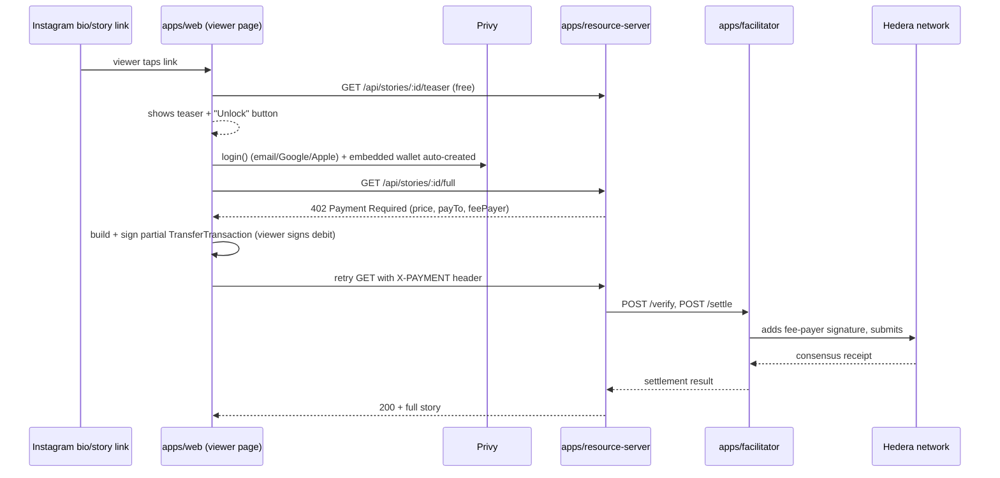

# x402 on Hedera: gated Instagram stories, unlocked from a fresh email

This covers the piece of the platform this session focused on: a viewer taps
"see the rest" on a gated story, and — with as little disconnection from the
original post as possible — ends up with a working Hedera account and a
completed micropayment.

## Why this shape

Three real, verified building blocks make the "minimal disconnection" goal
achievable today, and they compose almost for free:

1. **Hedera's own x402 "exact" scheme pays the network fee for the viewer.**
   Hedera's x402 integration ([hedera.com/blog/hedera-and-the-x402-payment-standard](https://hedera.com/blog/hedera-and-the-x402-payment-standard/))
   uses a *partially-signed transaction* model: the viewer signs a transfer
   authorizing the debit from their own account, but the transaction's
   declared fee-payer is the **facilitator's** operator account. The
   facilitator adds its own signature and submits. The viewer never needs
   HBAR for gas — full stop, no paymaster contract required. This is
   implemented for real in the `@x402/hedera` npm package (Coinbase's x402
   monorepo), which this repo uses directly (`apps/facilitator`,
   `apps/resource-server`).

2. **Hedera accounts auto-create from a Privy embedded wallet's address.**
   A Privy embedded wallet is a secp256k1 keypair with a standard EVM
   address (Hedera enabled ECDSA/secp256k1 keys via
   [HIP-222](https://hips.hedera.com/hip/hip-222)). Hedera lets you reference
   an account that doesn't exist yet by that same EVM address (an "alias" —
   [HIP-583](https://hips.hedera.com/HIP/hip-583.html)). The *first* transfer
   to that alias auto-creates a real ("hollow") account behind it. So: Privy
   login creates the wallet, and the very next HBAR transfer to it (the
   on-ramp top-up) is simultaneously the "create my Hedera account" step —
   there's no separate account-creation screen at all.

3. **HBAR needs no token association.** HTS tokens (including USDC on
   Hedera) require an explicit `TokenAssociateTransaction` on *both* sender
   and receiver before they can hold the token — an extra signed transaction,
   and one more thing that can fail (`TOKEN_NOT_ASSOCIATED_TO_ACCOUNT`) for a
   first-time viewer. Native HBAR has no such requirement. That's why
   `apps/resource-server` prices stories in tinybars, not Hedera-USDC — it's
   the difference between "one tap" and "two taps plus an association fee."

Given (1) and (2), **this repo does not use ZeroDev/ERC-4337 for the core
payment flow** — Hedera's native fee-payer/signer separation and hollow
account auto-creation already deliver "no pre-funded gas, no explicit account
creation," which is the problem account abstraction would otherwise be
solving. Nothing was found confirming ZeroDev has shipped Hedera support; if
you want it later, it'd slot in as an *optional* layer on Hedera's EVM JSON-RPC
relay (Hedera's Smart Contract Service is EVM-equivalent, so ERC-4337
infrastructure can in principle be deployed there) purely for session-keys —
letting a repeat viewer unlock a second and third story without a fresh Privy
signing prompt each time. Treat that as a v2 nice-to-have, not a dependency.

## Request flow



## What's implemented here

- `apps/facilitator` — the platform's own x402 facilitator for Hedera. Holds
  the operator key that pays every settlement's network fee. Exposes the
  three routes (`/verify`, `/settle`, `/supported`) that `@x402/core`'s
  `HTTPFacilitatorClient` expects.
- `apps/resource-server` — the paywall itself. One dynamic route,
  `GET /api/stories/:postId/full`, priced and paid-to per story (payTo is
  resolved from the authoring agent's ENS text record, `me.hedera.account`
  — the thin seam connecting this to the platform's ENS-identity piece).
- `apps/web` — the Next.js page an Instagram bio/story link points at:
  teaser → Privy login → balance check → (funding prompt) → sign & pay →
  unlocked content, all on one screen.

## Setup steps

### 1. Hedera testnet accounts

1. Go to the [Hedera Portal](https://portal.hedera.com/), sign up, and claim
   a funded testnet account — this gives you an account ID and an ECDSA
   private key. Create (at least) two: one for the **facilitator** operator,
   one to use as a **test creator payout account** (`payTo` for a demo
   story).
2. Put the facilitator's account ID + key into `apps/facilitator/.env`
   (`HEDERA_FACILITATOR_ACCOUNT_ID`, `HEDERA_FACILITATOR_PRIVATE_KEY`).
3. For a demo story priced in HTS-USDC instead of HBAR, mint testnet USDC
   from the [Circle faucet](https://faucet.circle.com/) (pick "Hedera
   Testnet") and associate it on both accounts with
   `TokenAssociateTransaction` (see the `@x402/hedera` README for the exact
   snippet) — but note the default in this repo is HBAR, precisely to skip
   this step for viewers.

### 2. ENS for the demo agent

Set a text record `me.hedera.account` on the agent's ENS name (or subdomain)
to the Hedera account ID you want story payments to land in. `apps/resource-server/src/ens.ts`
resolves this at request time (5 min cache). Point `ETH_RPC_URL` at any
Ethereum RPC provider (Alchemy, Infura, etc.) — it's a read-only lookup.

### 3. Privy

1. Create an app at [dashboard.privy.io](https://dashboard.privy.io).
2. Enable **Email**, **Google**, and **Apple** login methods.
3. Under Embedded Wallets, set wallet creation to happen for all users on
   login (this repo's `lib/providers.tsx` also sets `createOnLogin:
   "all-users"` client-side).
4. Copy the App ID into `NEXT_PUBLIC_PRIVY_APP_ID` / `PRIVY_APP_ID`, and
   generate an **App Secret** (Settings → API Keys) for `PRIVY_APP_SECRET` —
   this is only ever used server-side, in `app/api/hedera/sign`.

The raw-signing step (`app/api/hedera/sign/route.ts`) is implemented against
`privy.walletApi.ethereum.secp256k1Sign({ walletId, hash })` from
`@privy-io/server-auth@1.32.5`'s real type definitions (fetched and
inspected from npm, not guessed) — that method exists specifically to sign
an arbitrary digest, as opposed to `signMessage`/`signTypedData` which both
hash an Ethereum-prefixed message. On the Hedera side, the route uses
`Transaction.addSignature(publicKey, signatureBytes)` rather than
`Transaction.signWithSigner()` — the latter requires implementing the full
`@hiero-ledger/sdk` `Signer` interface (11 methods, only one of which is
relevant here); `addSignature` is the same lower-level primitive real Hedera
wallet integrations (HashPack, WalletConnect) use to inject an
externally-produced signature into an already-frozen transaction. Both the
digest format (`keccak256(bodyBytes)`, 64-byte compact `(r, s)`, per
HIP-179) and the `signableNodeBodyBytesList` API used to obtain those bytes
were confirmed against the installed `@hiero-ledger/sdk@2.85.0` and
`@hiero-ledger/cryptography@1.19.0` source.

One thing worth knowing about this design: `lib/hedera-privy-signer.ts`
pins the transaction to a single node account id (`0.0.3`) before freezing.
That's what keeps `signableNodeBodyBytesList` down to exactly one entry, so
`addSignature`'s plain-`Uint8Array` form applies without ambiguity. A
production version that wants resilience against that one node being
briefly unavailable should round-robin a small pool of node ids instead.

### 4. Funding the viewer's account (the open gap)

No onramp aggregator was confirmed at research time to deliver funds
directly to a Hedera network address, and Circle's CCTP (which many ramps
use for delivery) lists Hedera on its 2026 roadmap but hadn't shipped it.
Two ways to close this, in order of preference — check first, build second:

- **Path A**: query your chosen provider's live currency/network list
  (Onramper, Transak, MoonPay, Coinbase Onramp) for a Hedera destination.
  HBAR is commonly *purchasable* on these platforms; that's not the same as
  *deliverable to a Hedera account*, so confirm the destination-network
  support specifically. If it exists, this is a genuine one-tap flow:
  Apple/Google Pay → HBAR lands on the viewer's alias address → auto-creates
  their hollow account in the same step.
- **Path B (works today, adds float risk)**: onramp USDC on a
  well-supported EVM chain (e.g. Base) into the *same* address (a Privy
  embedded wallet's secp256k1 key is one address across every EVM chain,
  and Hedera accepts that same address as an alias). Your backend then
  advances the equivalent HBAR/Hedera-USDC to the viewer's Hedera account
  from a treasury float and reconciles the Base-side USDC asynchronously.
  This is a real, common pattern (front liquidity, true up later) but it's
  custodial float, not a trustless bridge — treat it as an interim measure.

`apps/web/lib/onramp.ts` documents this decision point in code; wire
`buildOnrampUrl()` up once you've picked a path.

### 5. Run it

```bash
pnpm install
cp apps/facilitator/.env.example apps/facilitator/.env      # fill in
cp apps/resource-server/.env.example apps/resource-server/.env
cp apps/web/.env.example apps/web/.env.local

pnpm dev:facilitator      # :4021
pnpm dev:resource-server  # :4000, talks to the facilitator over HTTP
pnpm dev:web              # :3000, visit /p/abc123
```

**Running this in a cloud dev environment (Codespaces or similar)?** The
page you load in your browser comes from a forwarded preview URL, e.g.
`https://<name>-3000.app.github.dev` — not `localhost`. "localhost" typed
into that browser tab means *your own machine*, not the container these
three services run in, so:

- Leave `NEXT_PUBLIC_RESOURCE_SERVER_URL` unset in `apps/web/.env.local` —
  `apps/web/lib/resource-server-url.ts` auto-detects the forwarded
  resource-server URL from the page's own hostname (swapping the `-3000`
  port segment for `-4000`). A hardcoded `localhost:4000` here is the #1
  cause of a confusing "CORS error" on `/p/:postId` — nothing is actually
  listening at your own machine's port 4000, and the browser reports that
  as a missing CORS header rather than a clearer connection failure.
- Make sure port 4000 is set to **public** visibility in your environment's
  ports panel. A private/default port often serves an auth interstitial
  page to unrecognized requests instead of reaching the app, which looks
  the same from the browser's side (no CORS headers, an unexpected body).
- `FACILITATOR_URL` in `apps/resource-server/.env` should stay
  `http://localhost:4021` — that traffic is server-to-server inside the
  same container, so real `localhost` resolution is correct there.

## What's grounded vs. what's still a decision

Everything in this repo — the x402 wire contracts, the Hedera signing flow,
the Privy raw-signing call — is verified against the real installed
packages (`pnpm install` + reading the actual `.d.ts`/source under
`node_modules`, plus `tsc --noEmit` passing clean in all three apps), not
guessed from memory. Two things remain genuine *decisions* rather than
verification gaps:

- **Onramp provider** (see step 4 above): which provider, and whether it's
  Path A (direct Hedera delivery, if you find one) or Path B (Base-USDC +
  treasury float). This is a business/vendor choice, not something to
  resolve in code without picking one.
- **Node account id resilience**: the single hardcoded `"0.0.3"` in
  `lib/hedera-privy-signer.ts` is fine for development; production should
  round-robin or fail over across a small pool of node ids.

### Duplicate `@hiero-ledger/sdk` installs

`@x402/hedera` bundles its own pinned copy of `@hiero-ledger/sdk`. Any file
that both (a) uses a `Client`/`Transaction`/etc. obtained from `@x402/hedera`
(e.g. `createHederaClient`) *and* (b) constructs Hedera SDK objects from a
separately-resolved direct `@hiero-ledger/sdk` dependency will hit runtime
errors like `t.startsWith is not a function`, because the SDK's internal
class-identity checks don't recognize objects from the "other" copy. This
bit both `apps/facilitator/src/signer.ts` (fixed by importing `PrivateKey`
from `@x402/hedera` instead of `@hiero-ledger/sdk`, and dropping the direct
dependency) and `apps/web/lib/hedera-privy-signer.ts` (fixed the same way,
plus pinning `apps/web`'s remaining direct `@hiero-ledger/sdk` dependency —
still needed for `PublicKey`, which `@x402/hedera` doesn't re-export — to
the exact version `@x402/hedera` depends on). If you bump `@x402/hedera`,
re-check this pin.
